# MusicAPI

API parecida a Spotify hecha con Node.js, TypeScript, Express, PostgreSQL y Prisma, donde los clientes se registran, inician sesión con JWT y pueden ver el catálogo, buscar música y manejar sus listas, favoritos e historial.

## Propuesta de mejores prácticas

Esto es lo que utilicé y el motivo por el que lo hice y por qué estas considero que son buenas prácticas para una API análoga a Spotify

**Seguridad:** El token de acceso es corto para que robarlo sirva de poco, el de refresco se rota en cada uso, se guarda solo como hash y se detecta si alguien lo reutiliza, los dos tokens se firman con secretos distintos, con algoritmo y emisor fijos, y se rechazan los tokens sin firma, las contraseñas van con bcrypt y se pide una longitud mínima con letra y número, al iniciar sesión se responde igual si falla el correo o la contraseña, para que no se pueda saber qué correos existen, los datos se validan de forma estricta y se rechazan campos inesperados, por ejemplo alguien que mande un rol de administrador al registrarse, hay límite de peticiones, 10 intentos cada 15 minutos en registro e inicio de sesión y 100 por minuto en el resto, cada usuario solo ve y modifica lo suyo, y el catálogo solo lo modifica un administrador, los secretos van en variables de entorno, se usan Helmet y CORS, la base de datos solo se alcanza desde la misma máquina y el contenedor corre sin permisos de administrador.

**Diseño de la API:** Las rutas llevan versión para poder cambiar la API sin romper a nadie, se usan los métodos y códigos HTTP que corresponden, los errores tienen siempre el mismo formato y los listados vienen paginados con tope, acciones como marcar un favorito o cerrar sesión se pueden repetir sin problema. Una lista privada ajena responde como si no existiera, para no revelar nada, todo está en el mismo idioma, es decir, en español para que la API, el código y la base de datos sean coherentes y Swagger documenta las rutas.

**Arquitectura y código:** TypeScript en modo estricto para encontrar errores antes de ejecutar, los tipos salen de Prisma y de los esquemas de Zod, así cada cosa se define una sola vez, el código va separado en capas y en módulos por tema, los errores se manejan en un solo lugar, la configuración se valida al arrancar y el servidor se apaga ordenadamente.

**Datos:** Migraciones versionadas, índices en los campos que se buscan y se relacionan, y UUID como identificadores para que no se puedan adivinar, las relaciones definen qué pasa al borrar, las operaciones críticas como la rotación de tokens van en transacciones, y todo el acceso es con Prisma, sin SQL escrito a mano, lo que evita la inyección de SQL.

**Calidad y operación:** Más de sesenta pruebas automáticas, con una base de datos falsa en memoria, revisan los casos de seguridad más importantes. Los tipos y el estilo se revisan con herramientas y GitHub Actions corre todo en cada cambio, además de auditar las dependencias y construir la imagen de Docker, la imagen es de varias etapas, tiene una ruta de estado para saber si el servicio está vivo, y los registros salen en JSON.

## Cómo correrlo

Necesitas Node.js 20 o más y Docker Desktop.

```bash
npm install
cp .env.example .env
docker compose up -d --wait
npm run prisma:generate
npx prisma migrate dev --name init
npm run seed
npm run dev
```

Antes de arrancar, abre el `.env` y cambia los dos secretos JWT por valores largos y distintos. Puedes generarlos con:

```bash
node -e "console.log(require('crypto').randomBytes(64).toString('hex'))"
```

El `npm run seed` crea el administrador con los datos `ADMIN_CORREO`, `ADMIN_NOMBRE_USUARIO` y `ADMIN_CONTRASENA` del `.env`. Si `SEED_DATOS_DEMO` es `true` crea también un artista, un álbum y tres canciones de ejemplo.

Cosas que pasan en Windows: la base de datos queda en `127.0.0.1:5433` para no chocar con un PostgreSQL que ya tengas instalado, y por eso la `DATABASE_URL` usa `127.0.0.1` y no `localhost`, ya que Prisma falla si `localhost` se resuelve a IPv6. La migración se corre con `npx` porque PowerShell pierde el `--name` cuando se pasa por `npm run`.

Con el servidor andando puedes probar `http://localhost:3000/health` y la documentación de Swagger en `http://localhost:3000/api-docs`, que se apaga en producción.

Otros comandos útiles: `npm test`, `npm run lint`, `npm run typecheck` y `npm run build` seguido de `npm start` para producción. Para la imagen de Docker es `docker build -t musicapi .`. Las migraciones no se aplican solas al arrancar, en un despliegue se corren aparte con `npx prisma migrate deploy`.

## Estructura

En la raíz hay una carpeta `prisma` con el esquema y las migraciones, una carpeta `src` con el código y una carpeta `tests` con las pruebas. Dentro de `src` están `config`, `middlewares`, `utils`, `docs` para Swagger, `scripts` para el seed y `modules`, donde hay una carpeta por tema: auth, usuarios, artistas, albumes, canciones, busqueda, listas, favoritos e historial. Cada módulo tiene sus rutas, controlador, servicio, repositorio y esquemas. La petición pasa en ese orden, y solo el repositorio habla con la base de datos.

## Base de datos

Son nueve tablas: `usuarios`, `tokens_refresco`, `artistas`, `albumes`, `canciones`, `listas_reproduccion`, `lista_canciones`, `favoritos` e `historial_reproduccion`. Las tablas van en español con guion bajo, y los campos mantienen la misma idea. El esquema completo está en `prisma/schema.prisma`.

## Rutas

Todas empiezan con `/api/v1`.

```
POST   /auth/registro
POST   /auth/iniciar-sesion
POST   /auth/refrescar
POST   /auth/cerrar-sesion

GET    /usuarios/yo

GET    /artistas /albumes /canciones también /:id
POST   /artistas  /albumes  /canciones solo ADMIN
PATCH  y DELETE sobre /:id solo ADMIN
GET    /buscar?q=

GET    /listas POST /listas
GET    /listas/:id PATCH /listas/:id DELETE /listas/:id
POST   /listas/:id/canciones
DELETE /listas/:id/canciones/:cancionId

GET    /favoritos
PUT    /favoritos/:id DELETE /favoritos/:id

GET    /historial POST /historial DELETE /historial
```

Los listados aceptan `?pagina=1&limite=20`, con un máximo de 100 por página. Los errores siempre tienen la forma `{ "error": { "codigo", "mensaje", "detalles" } }`.

## Autenticación

Al registrarse o iniciar sesión se reciben dos tokens. El de acceso dura 15 minutos y se manda en la cabecera `Authorization: Bearer <token>`, el de refresco dura 7 días y solo sirve en `/auth/refrescar`, que lo cambia por un par nuevo e invalida el anterior, si alguien usa un token de refresco que ya se usó, se cierran todas las sesiones de ese usuario. Los usuarios nuevos siempre son `USUARIO`, el único `ADMIN` sale del seed.

Un ejemplo en PowerShell:

```powershell
$base = "http://localhost:3000/api/v1"
$cuerpo = @{ correo = "ana@ejemplo.com"; nombreUsuario = "ana_01"; contrasena = "Secreta123" } | ConvertTo-Json
$sesion = Invoke-RestMethod -Method Post -Uri "$base/auth/registro" -ContentType "application/json" -Body $cuerpo
Invoke-RestMethod "$base/usuarios/yo" -Headers @{ Authorization = "Bearer $($sesion.tokenAcceso)" }
```

## Capturas

Llamadas reales a la API en funcionamiento. Los tokens aparecen recortados.

Documentación interactiva con Swagger en /api-docs.

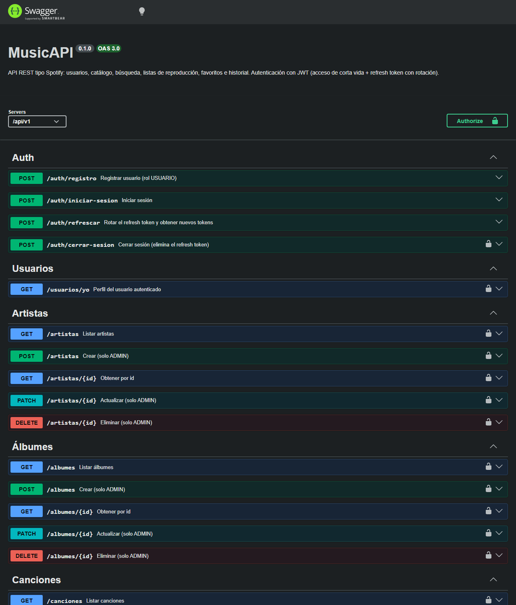

Comprobación del servicio en /health.

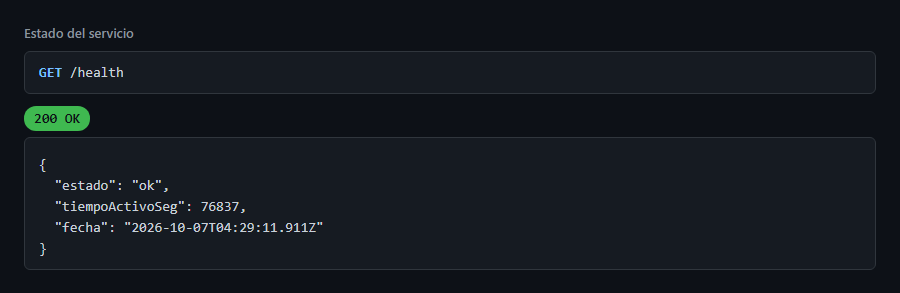

Registro de un usuario: siempre se crea con rol USUARIO.

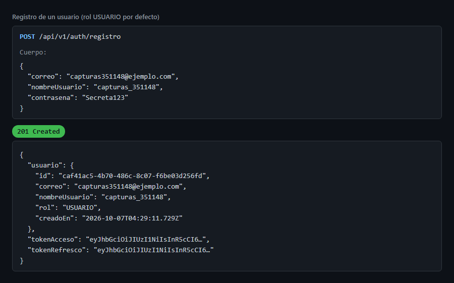

Inicio de sesión del administrador, que devuelve el token de acceso y el de refresco.

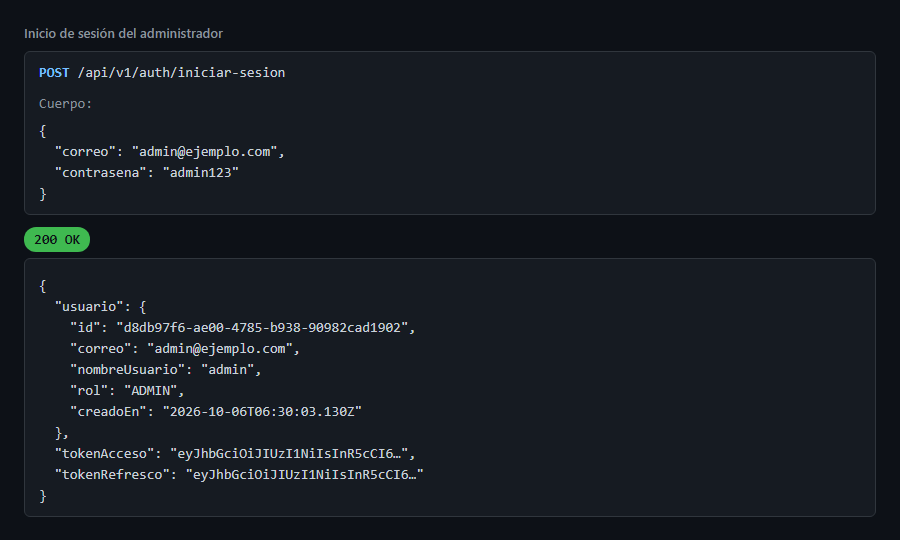

Intento de registrarse con rol ADMIN: se rechaza con 400.

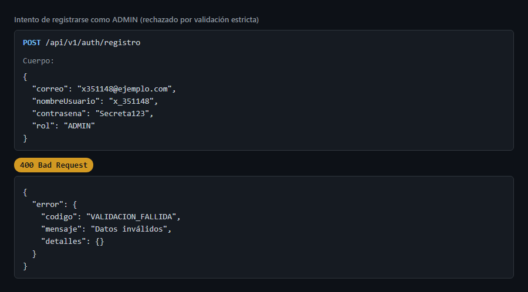

Ruta protegida sin token: 401.

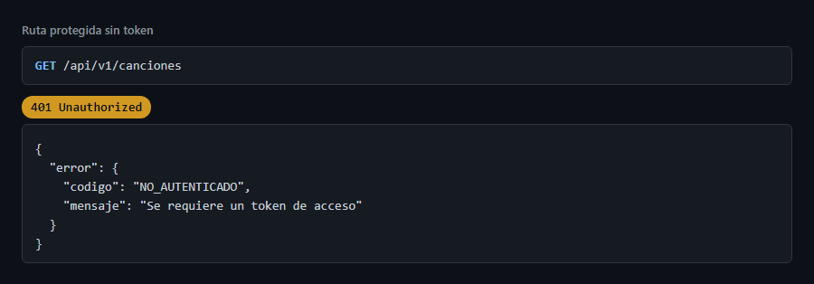

Listado paginado de canciones.

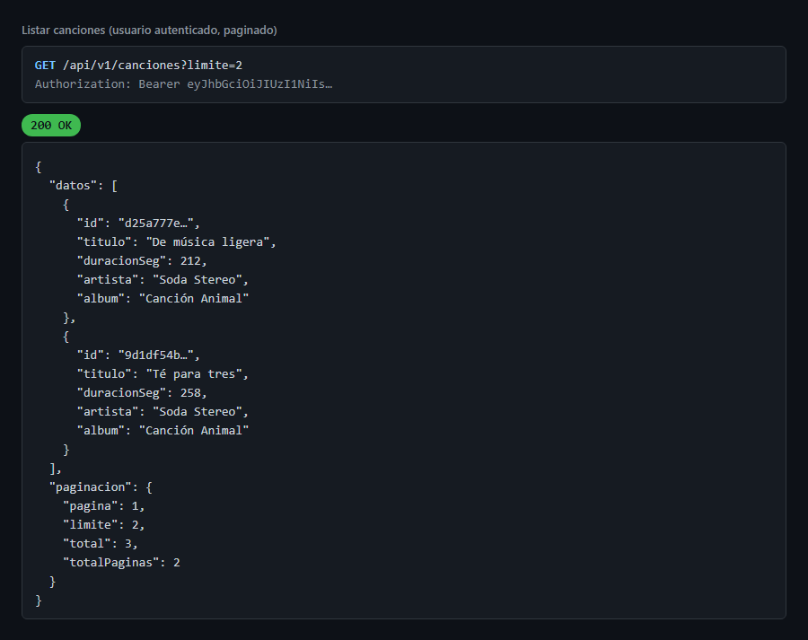

Búsqueda combinada de artistas, álbumes y canciones.

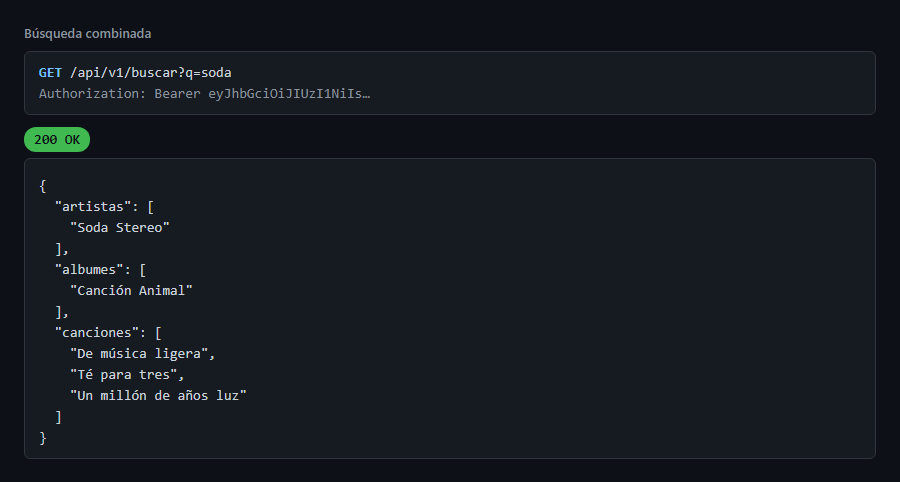

Un USUARIO intenta crear un artista: 403.

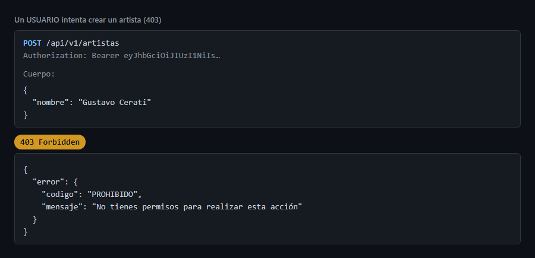

Un ADMIN crea un artista: 201.

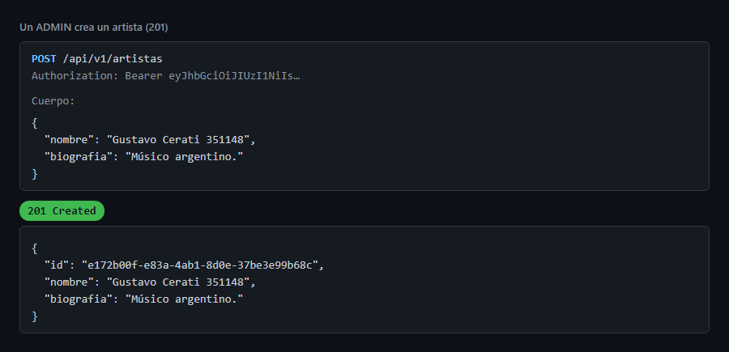

Creación de una lista de reproducción.

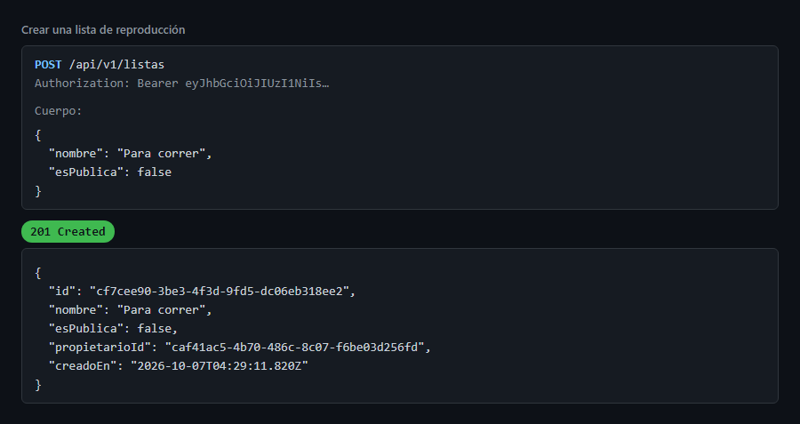

Se agrega una canción a la lista.

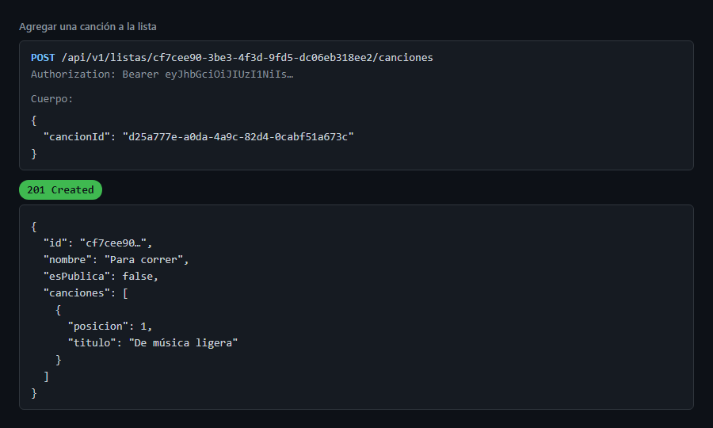

Agregar la misma canción otra vez: 409.

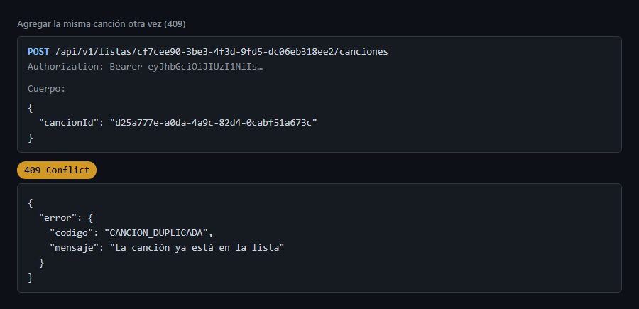

Otro usuario pide una lista privada ajena: 404, como si no existiera.

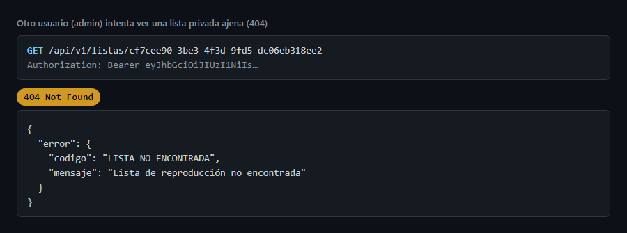

Marcar una canción como favorita.

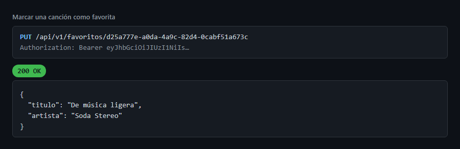

Registrar una reproducción en el historial.

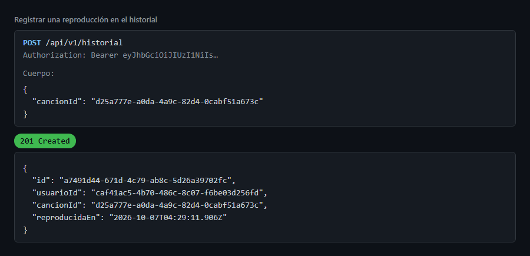
